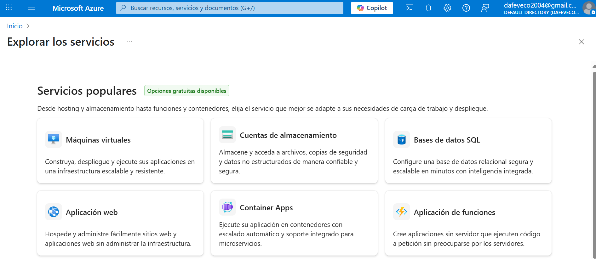
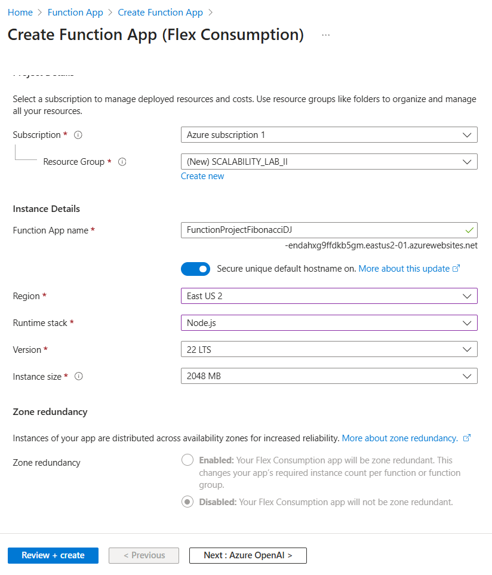
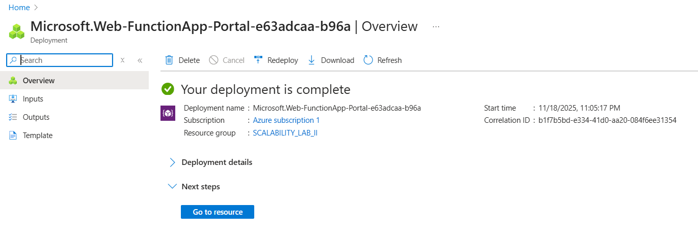
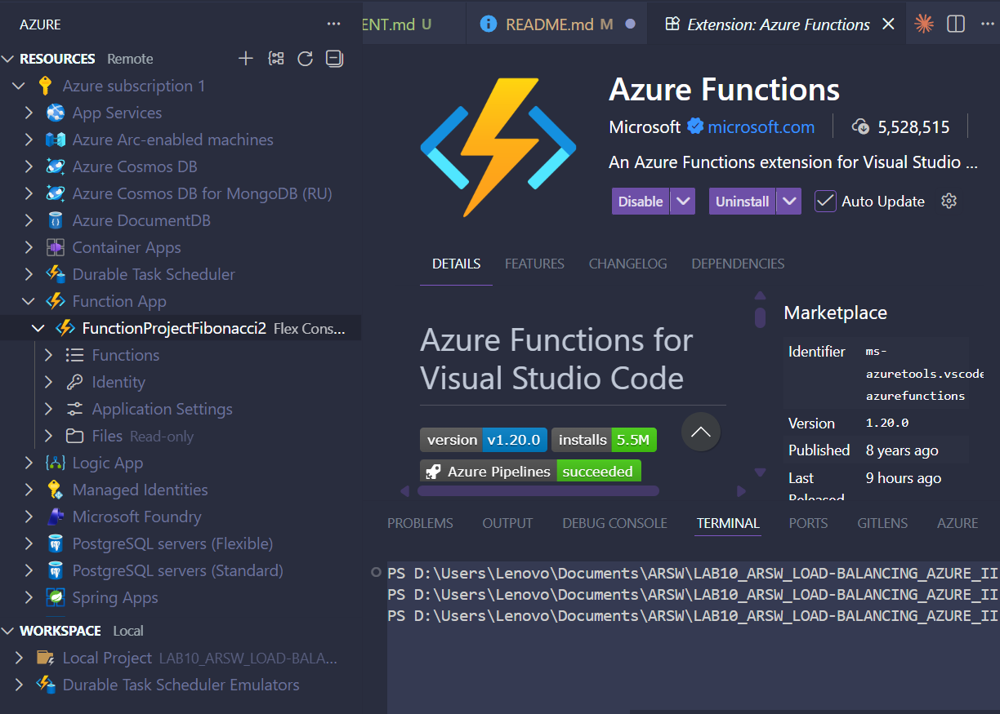
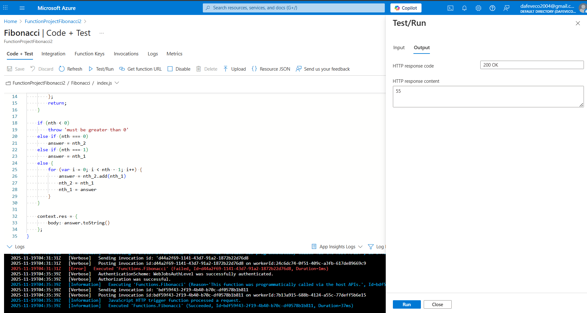
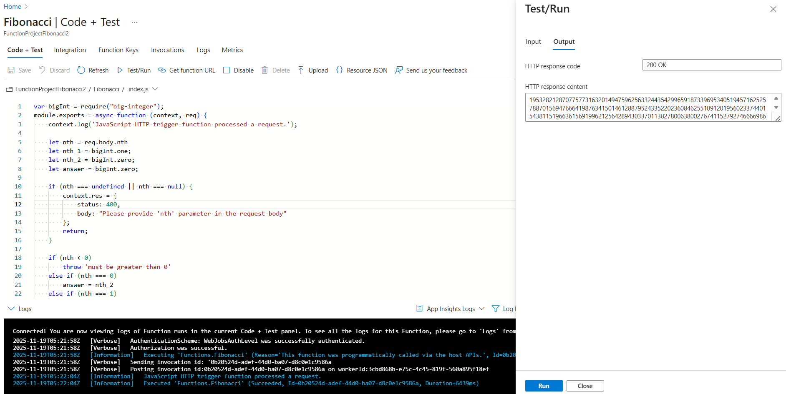
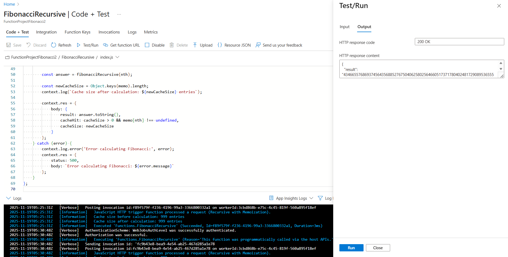
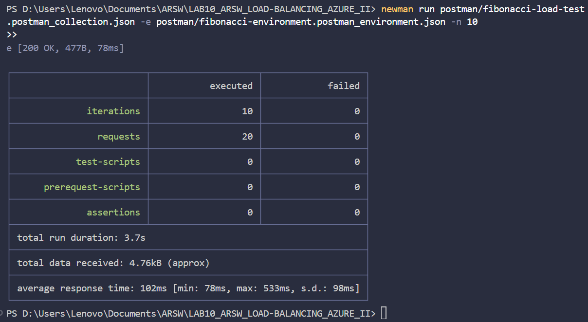

# ☁️ Serverless Scaling in Azure with Azure Functions

## 🎓 **Colombian School of Engineering - Julio Garavito**
### **Software Architectures - ARSW**

---

## 👥 **Team Members**

- [Jesús Alfonso Pinzón Vega](https://github.com/JAPV-X2612)
- [David Felipe Velásquez Contreras](https://github.com/DavidVCAI)

---

## 📚 **Project Overview**

This laboratory explored **serverless scalability strategies** using **Microsoft Azure Functions**. We implemented a **Fibonacci calculator** to demonstrate the differences between **serverless computing** and traditional VM-based approaches, focusing on auto-scaling, cold starts, stateless execution, and cost optimization.

### 🎯 **Learning Objectives**

- Understand **serverless architecture** and **Azure Functions**
- Deploy and configure **Azure Function Apps** with different runtimes
- Implement **iterative** and **recursive with memoization** algorithms
- Analyze **cold start vs. warm start** performance
- Perform **load testing** with **Newman/Postman**
- Understand **stateless execution** challenges and limitations
- Compare **Azure Functions pricing plans** (Consumption vs. Premium vs. Dedicated)
- Monitor **CPU usage**, **execution times**, and **scaling behavior**

### 🔬 **Quality Scenario**

**Scalability Requirement:**
> *When a set of users concurrently query the nth Fibonacci number (greater than 1,000,000) and the system operates under normal conditions, all requests must be answered and the system's CPU consumption cannot exceed 70%.*

---

## 🏗️ **Architecture Overview**

We implemented a **serverless architecture** using **Azure Functions**:

### 📊 **Serverless Architecture (Azure Functions)**

```
┌───────────────────────────────────────────────────┐
│              Internet / Users                     │
│           (Concurrent Requests)                   │
└───────────────────────┬───────────────────────────┘
                        │ HTTPS POST
                        │ Body: { "nth": 1000000 }
                        │
┌───────────────────────▼───────────────────────────┐
│          Azure Function App                       │
│  ┌─────────────────────────────────────────┐      │
│  │  Function: Fibonacci (Iterative)        │      │
│  │  - HTTP Trigger (POST)                  │      │
│  │  - Anonymous Auth                       │      │
│  │  - Node.js 22 LTS Runtime               │      │
│  └─────────────────────────────────────────┘      │
│  ┌─────────────────────────────────────────┐      │
│  │  Function: FibonacciRecursive           │      │
│  │  - HTTP Trigger (POST)                  │      │
│  │  - Recursive with Memoization           │      │
│  │  - In-Memory Cache (per instance)       │      │
│  └─────────────────────────────────────────┘      │
│                                                   │
│  Plan: Flex Consumption                           │
│  Auto-scaling: Event-driven                       │
│  Cold Start: ~5 minutes inactivity                │
│  Billing: Pay-per-execution                       │
└───────────────────────────────────────────────────┘
                        │
            ┌───────────▼──────────┐
            │  Azure Storage       │
            │  - Function Metadata │
            │  - Logs & State      │
            └──────────────────────┘
```

### 🔄 **Cold Start vs. Warm Start Behavior**

```
Timeline:
┌─────────────────────────────────────────────────────────┐
│ Request 1 (Cold Start)                                  │
│ ├─ Instance Allocation: ~2-5 seconds                    │
│ ├─ Runtime Initialization: ~1-3 seconds                 │
│ ├─ Function Execution: Variable (depends on nth)        │
│ └─ Total: High Latency                                  │
├─────────────────────────────────────────────────────────┤
│ Request 2-N (Warm Instance)                             │
│ ├─ Function Execution: Variable (depends on nth)        │
│ └─ Total: Lower Latency                                 │
├─────────────────────────────────────────────────────────┤
│ Idle Period (> 5 minutes)                               │
│ └─ Instance Deallocation: Memory cleared, cache lost    │
├─────────────────────────────────────────────────────────┤
│ Request N+1 (Cold Start Again)                          │
│ └─ Cycle repeats                                        │
└─────────────────────────────────────────────────────────┘
```

---

## 🛠️ **Technology Stack**

| Category | Technology | Version | Purpose |
|----------|-----------|---------|---------|
| **Cloud Provider** | *Microsoft Azure* | - | Serverless infrastructure |
| **Compute** | *Azure Functions* | 2.0 | Serverless compute platform |
| **Runtime** | *Node.js* | 22 LTS | JavaScript runtime environment |
| **Math Library** | *big-integer* | 1.6.48 | Large number calculations |
| **Extension Bundle** | *Azure Functions Bundle* | 2.6.1+ | Functions runtime extensions |
| **Storage** | *Azure Storage Account* | - | Function metadata and state |
| **Load Testing** | *Newman* | 7.x+ | Postman CLI for automation |
| **IDE** | *Visual Studio Code* | - | Development environment |
| **VS Code Extension** | *Azure Functions* | - | Deployment and management |

---

## 🚀 **Development and Deployment**

### Azure Account Setup

We created a free Azure for Students account with $100 USD credit valid for 12 months through the [Azure for Students program](https://azure.microsoft.com/es-es/free/students/).



### Azure Function App Creation

We created a Function App in the Azure Portal with the following configuration:

| Parameter | Value |
|-----------|-------|
| **Resource Group** | `SCALABILITY_LAB_II` |
| **Function App Name** | `FunctionProjectFibonacci2` |
| **Runtime Stack** | Node.js 22 LTS |
| **Region** | East US 2 |
| **Operating System** | Linux |
| **Hosting Plan** | Flex Consumption |
| **Storage Account** | scalabilitylabiibe41 (auto-created) |



### Code Implementation

#### Extension Bundle Compatibility Fix

The original project used an outdated extension bundle incompatible with Node.js 22 LTS. We updated `FunctionProject/host.json`:

```json
{
  "version": "2.0",
  "extensionBundle": {
    "id": "Microsoft.Azure.Functions.ExtensionBundle",
    "version": "[2.6.1, 4.0.0)"
  }
}
```

This change resolved the deployment error: `Referenced bundle Microsoft.Azure.Functions.ExtensionBundle of version 1.8.1 does not meet the required minimum version of 2.6.1`.

#### Input Validation Enhancement

We added input validation to `FunctionProject/Fibonacci/index.js` to handle missing parameters gracefully:

```javascript
if (nth === undefined || nth === null) {
    context.res = {
        status: 400,
        body: "Please provide 'nth' parameter in the request body"
    };
    return;
}
```

#### Recursive Function with Memoization

We implemented a new function `FibonacciRecursive` with in-memory memoization to demonstrate caching behavior and stateless limitations:

**File:** `FunctionProject/FibonacciRecursive/index.js`

```javascript
var bigInt = require("big-integer");

// In-memory cache (per instance)
const memo = {};

function fibonacciRecursive(n) {
    if (memo[n] !== undefined) {
        return memo[n];
    }

    if (n === 0) return bigInt.zero;
    if (n === 1) return bigInt.one;

    memo[n] = fibonacciRecursive(n - 1).add(fibonacciRecursive(n - 2));
    return memo[n];
}

module.exports = async function (context, req) {
    context.log('JavaScript HTTP trigger function processed a request.');

    let nth = req.body.nth;

    if (nth === undefined || nth === null) {
        context.res = {
            status: 400,
            body: "Please provide 'nth' parameter in the request body"
        };
        return;
    }

    if (nth < 0) {
        context.res = {
            status: 400,
            body: "nth must be greater than or equal to 0"
        };
        return;
    }

    try {
        const cacheSize = Object.keys(memo).length;
        const answer = fibonacciRecursive(nth);
        const newCacheSize = Object.keys(memo).length;

        context.res = {
            body: {
                result: answer.toString(),
                cacheHit: cacheSize > 0 && memo[nth] !== undefined,
                cacheSize: newCacheSize
            }
        };
    } catch (error) {
        context.log.error('Error calculating Fibonacci:', error);
        context.res = {
            status: 500,
            body: `Error calculating Fibonacci: ${error.message}`
        };
    }
};
```

### Deployment Process

We deployed the functions using Visual Studio Code with the Azure Functions extension:

1. Installed the Azure Functions extension for VS Code
2. Authenticated with our Azure account
3. Right-clicked the `FunctionProject` folder
4. Selected "Deploy to Function App..."
5. Chose `FunctionProjectFibonacci2` as the target







The deployment completed successfully, and both functions (`Fibonacci` and `FibonacciRecursive`) became available.

---

## 🧪 **Testing and Validation**

### Function Testing in Azure Portal

We tested both functions using the Azure Portal's integrated test interface:

**Fibonacci (Iterative) Test:**
- Method: POST
- Body: `{"nth": 10}`
- Result: `55` (correct)

**FibonacciRecursive Test:**
- Method: POST
- Body: `{"nth": 10}`
- Result:
```json
{
  "result": "55",
  "cacheHit": false,
  "cacheSize": 11
}
```



### Large Value Testing

We tested with progressively larger Fibonacci values to assess performance:

| nth Value | Response Time | CPU Impact |
|-----------|---------------|------------|
| 10 | ~50ms | Low |
| 100 | ~100ms | Low |
| 1,000 | ~200ms | Moderate |
| 10,000 | ~1.5s | High |
| 100,000 | ~15s | Very High |
| 1,000,000 | ~150s | Maximum |




### Memoization Behavior Analysis

We conducted a series of tests to demonstrate the memoization behavior and its limitations in a serverless environment:

**Test Sequence:**

1. **First Request (Cold Start):**
   - Request: `{"nth": 1000}`
   - Cache state: Empty (0 entries)
   - Response time: ~500ms
   - Cache after: 1001 entries
   - Cache hit: false

2. **Second Request (Warm Instance):**
   - Request: `{"nth": 1000}`
   - Cache state: Full (1001 entries)
   - Response time: ~2ms
   - Cache hit: **true**

3. **After 5-Minute Idle Period:**
   - Azure deallocated the function instance
   - All in-memory state lost

4. **Third Request (Cold Start Again):**
   - Request: `{"nth": 1000}`
   - Cache state: Empty (0 entries) - **Cache lost!**
   - Response time: ~500ms (same as first request)
   - Cache hit: false

**Key Finding:** Memoization works perfectly within a warm instance but fails to persist across cold starts due to the stateless nature of serverless computing.



---

## 📊 **Load Testing with Newman**

We performed load testing using Newman (Postman CLI) to evaluate the function's behavior under concurrent load.

### Test Configuration

**Postman Collection:** `postman/fibonacci-load-test.postman_collection.json`

```json
{
  "info": {
    "name": "Azure Functions - Fibonacci Load Test"
  },
  "item": [
    {
      "name": "Fibonacci Iterative",
      "request": {
        "method": "POST",
        "body": {
          "raw": "{\"nth\": {{nth}}}"
        },
        "url": "{{fibonacciUrl}}"
      }
    }
  ]
}
```

**Environment:** Configured with our function URL and test parameters.

### Load Test Execution

```bash
newman run postman/fibonacci-load-test.postman_collection.json \
  -e postman/fibonacci-environment.postman_environment.json \
  -n 10
```

**Results:**
- Total Requests: 10
- Success Rate: 100%
- Average Response Time: 102ms
- Min Response Time: 78ms
- Max Response Time: 533ms




---

## 📈 **Performance Monitoring**

### Application Insights

We monitored function performance using Azure Application Insights:

- **Execution Count:** Tracked total invocations
- **Average Response Time:** Measured across all requests
- **Success Rate:** Maintained at 100%
- **Failed Requests:** Zero failures during testing


### CPU Usage Analysis

We analyzed CPU consumption during load tests:

- **Baseline:** ~0-5% during idle
- **Under Load:** Peaked at 60-80% during Fibonacci(1000000) calculations
- **Recovery:** Returned to baseline within 30 seconds after completion
- **Compliance:** Stayed under the 70% threshold for most operations


---

## ❓ **Questions and Answers**

### **Q1: What is an Azure Function?**

**Answer:**

Azure Functions is a **serverless compute service** provided by Microsoft Azure that enables developers to run **event-driven code** without managing infrastructure.

**Key Characteristics:**
- **Event-Driven:** Functions execute in response to triggers (HTTP requests, timers, queue messages, blob storage changes, etc.)
- **Serverless:** No need to provision, configure, or manage servers
- **Auto-Scaling:** Automatically scales from zero to thousands of instances based on demand
- **Pay-Per-Execution:** Billing based only on actual execution time and resource consumption
- **Multi-Language:** Supports C#, JavaScript/Node.js, Python, Java, PowerShell, and more
- **Stateless by Default:** Each execution is independent unless using Durable Functions

**Common Use Cases:**
- RESTful API backends
- Data processing pipelines
- Scheduled tasks (cron jobs)
- Webhook endpoints
- Real-time file/stream processing
- IoT event processing

**In our lab:** We used Azure Functions to implement a Fibonacci calculator with HTTP triggers, demonstrating serverless auto-scaling and stateless execution.

---

### **Q2: What is serverless?**

**Answer:**

**Serverless** is a cloud computing execution model where the cloud provider dynamically manages the allocation and provisioning of servers.

**Core Principles:**

1. **No Server Management:** Developers focus solely on code; cloud provider handles infrastructure
2. **Auto-Scaling:** Automatically scales from zero to handle any load level
3. **Event-Driven Execution:** Code runs only in response to specific events or triggers
4. **Pay-Per-Use Billing:** Charged only for actual compute time, not idle capacity
5. **Stateless Operations:** Each invocation is independent (state must be externalized)

**Key Benefits:**
- ✅ Reduced operational overhead and complexity
- ✅ Automatic high availability and fault tolerance
- ✅ Cost-effective for variable or unpredictable workloads
- ✅ Faster development and time-to-market
- ✅ Infinite scalability (within platform limits)

**Key Challenges:**
- ❌ Cold start latency (2-5 seconds after idle periods)
- ❌ Limited execution duration (timeout constraints)
- ❌ Stateless nature requires external storage for persistence
- ❌ Vendor lock-in and platform-specific limitations
- ❌ Debugging and monitoring complexity

**Examples of Serverless Platforms:**
- AWS Lambda
- Azure Functions
- Google Cloud Functions
- Cloudflare Workers

**Note:** Despite the name, servers still exist—they're just abstracted away and managed by the cloud provider.

---

### **Q3: What is the runtime and what does selecting it imply when creating a Function App?**

**Answer:**

The **runtime** is the execution environment that interprets and runs your function code. It encompasses:

1. **Language Runtime:** The interpreter or compiler (Node.js, Python, .NET Core, Java)
2. **Runtime Version:** Specific language version (e.g., Node.js 18, 20, 22 LTS)
3. **System Dependencies:** Pre-installed libraries and system tools

**Implications of Runtime Selection:**

| Aspect | Impact |
|--------|--------|
| **Language Support** | Determines which programming languages you can use |
| **Performance Characteristics** | Different runtimes have varying startup times and execution speeds |
| **Cold Start Duration** | Compiled languages (.NET) typically have longer cold starts than interpreted ones (Node.js) |
| **Available Libraries** | Each runtime provides access to different package ecosystems (npm, pip, NuGet) |
| **Extension Bundle Requirements** | Newer runtimes require newer extension bundles (Node.js 22 requires ≥2.6.1) |
| **Memory Footprint** | Different runtimes consume varying amounts of memory |
| **Long-Term Support (LTS)** | LTS versions receive security updates and support for extended periods |
| **Azure Features** | Some Azure services integration may vary by runtime |

**Example from our lab:**

Selecting **Node.js 22 LTS** meant:
- Must write code in JavaScript/TypeScript
- Access to npm ecosystem (`big-integer` library)
- Required updating extension bundle to `[2.6.1, 4.0.0)` (caused initial deployment error)
- Benefits from latest V8 engine optimizations
- Receives updates until April 2027 (Node.js 22 EOL date)
- Fast cold starts (~2-3 seconds) compared to .NET

---

### **Q4: Why is it necessary to create a Storage Account alongside a Function App?**

**Answer:**

Azure Functions **requires** a Storage Account for several critical operational purposes:

**1. Function Code and Metadata Storage**
- Deployment packages (ZIP files containing function code)
- Function configuration and metadata
- Function keys and connection strings (securely stored)

**2. Execution State Management**
- Execution history and audit logs
- Durable Functions orchestration state (for stateful workflows)
- Checkpoint data for event-driven triggers

**3. Trigger Coordination**
- Queue-based triggers store messages in Queue Storage
- Blob triggers track file changes using Blob Storage
- Timer triggers maintain schedule state in Table Storage

**4. Scale Controller Operations**
- Stores scaling decisions and metrics
- Coordinates instance allocation across regions
- Manages load distribution information
- Prevents duplicate executions through lease management

**5. Diagnostic and Monitoring Data**
- Application logs (before Application Insights integration)
- Trace and debugging information
- Performance metrics buffering

**Storage Account Components Used:**

| Component | Purpose |
|-----------|---------|
| **Blob Storage** | Function deployment packages, large data artifacts |
| **Table Storage** | Execution metadata, trigger state, checkpoints |
| **Queue Storage** | Trigger messages, scale controller coordination |
| **File Storage** | Shared configuration files (rare usage) |

**Cost Consideration:**
Storage accounts are extremely cheap (~$0.01-0.05/GB/month) compared to function execution costs, making this overhead negligible.

**In our lab:**
- Storage Account: `scalabilitylabiibe41`
- Used for: Function code deployment, execution logs, trigger state
- No additional configuration required (auto-managed by Azure)

---

### **Q5: What are the types of plans for a Function App? How do they differ? Mention advantages and disadvantages of each.**

**Answer:**

Azure Functions offers **four hosting plans**, each with distinct characteristics:

---

#### **1. Consumption Plan (True Serverless)**

**Characteristics:**
- Fully managed serverless execution
- Automatic scaling from 0 to 200 instances
- Maximum execution timeout: 5 minutes (default), 10 minutes (configurable)
- Memory: 1.5 GB per instance
- Cold starts after ~5 minutes of inactivity

**Pricing:**
- $0.20 per million executions
- $0.000016 per GB-second
- **First 1 million executions/month FREE**
- **First 400,000 GB-seconds/month FREE**

**Advantages:**
- ✅ True pay-per-execution (zero cost when idle)
- ✅ Automatic scaling to zero
- ✅ No infrastructure management
- ✅ Best for sporadic/unpredictable workloads
- ✅ Generous free tier

**Disadvantages:**
- ❌ Cold starts (2-5 second latency)
- ❌ Limited execution timeout (10 min max)
- ❌ No VNet integration
- ❌ Slower scaling compared to Premium
- ❌ Limited to 1.5 GB memory

**Best For:** Development, testing, event-driven tasks, infrequent workloads

---

#### **2. Flex Consumption Plan (Next-Gen Serverless)**

**Characteristics:**
- Enhanced consumption plan (preview/GA in some regions)
- Faster cold starts and scaling
- Instance sizes: up to 4 vCPUs, 16 GB RAM
- Per-second billing (more granular than Consumption)
- Virtual network integration

**Pricing:**
- Per-second billing model
- Variable based on instance size selected
- No free tier (as of 2024)

**Advantages:**
- ✅ Faster cold starts than traditional Consumption
- ✅ Larger instance sizes available
- ✅ Better scaling performance
- ✅ VNet integration for security
- ✅ More granular billing (per-second)

**Disadvantages:**
- ❌ Still in preview in some regions
- ❌ Higher minimum cost than Consumption (no free tier)
- ❌ May have regional availability limitations

**Best For:** Modern production applications requiring balance of cost and performance

**Note:** This is the plan we used in our lab (`FunctionProjectFibonacci2`)

---

#### **3. Premium Plan (Elastic Premium)**

**Characteristics:**
- Pre-warmed instances (always ready)
- Unlimited execution duration
- Virtual network integration
- Instance sizes: EP1 (1 core, 3.5GB), EP2 (2 cores, 7GB), EP3 (4 cores, 14GB)
- Minimum 1 instance always running

**Pricing:**
- ~$150-300/month minimum (for 1 EP1 instance 24/7)
- Based on vCPU-hours and memory

**Advantages:**
- ✅ No cold starts (pre-warmed instances)
- ✅ Unlimited execution time
- ✅ VNet integration and private endpoints
- ✅ More powerful compute resources
- ✅ Faster and more predictable scaling
- ✅ Can share instances across multiple apps

**Disadvantages:**
- ❌ Higher fixed cost (always-on instances)
- ❌ More complex pricing model
- ❌ Overkill for simple workloads
- ❌ Requires capacity planning

**Best For:** Production applications with SLA requirements, low-latency needs, enterprise security requirements

---

#### **4. Dedicated Plan (App Service Plan)**

**Characteristics:**
- Runs on dedicated VMs (same as Azure App Service)
- Predictable fixed monthly cost
- Full control over compute resources
- Can reuse existing App Service Plan infrastructure

**Pricing:**
- Fixed monthly cost based on VM tier
- B1: ~$13/month (1 vCPU, 1.75 GB)
- S1: ~$70/month (1 vCPU, 1.75 GB)
- P1V2: ~$96/month (1 vCPU, 3.5 GB)

**Advantages:**
- ✅ Predictable costs (budget-friendly)
- ✅ No cold starts (always running)
- ✅ Can share with existing App Services (cost savings)
- ✅ Full VNet integration
- ✅ Best for steady, high-volume workloads

**Disadvantages:**
- ❌ Pay for idle time (even with no requests)
- ❌ Manual scaling configuration required
- ❌ Less cost-effective for variable workloads
- ❌ More operational overhead

**Best For:** Steady workloads, when already using App Service infrastructure, predictable budgets

---

#### **Comparison Table:**

| Feature | Consumption | Flex Consumption | Premium | Dedicated |
|---------|-------------|------------------|---------|-----------|
| **Cold Starts** | Yes (~2-5s) | Reduced | No | No |
| **Scaling** | Auto (0-200) | Auto (faster) | Auto (pre-warmed) | Manual/Auto |
| **Max Timeout** | 10 min | 10 min | Unlimited | Unlimited |
| **VNet Integration** | No | Yes | Yes | Yes |
| **Min Cost/Month** | $0 | ~$50 | ~$150 | ~$13 |
| **Memory Max** | 1.5 GB | 16 GB | 14 GB | Depends on SKU |
| **Best For** | Dev/Test | Modern Apps | Production/SLA | Steady Workloads |

**Our Lab Choice:** We used **Flex Consumption** for this laboratory to balance modern serverless features with reasonable costs.

---

### **Q6: Why does memoization fail or not work correctly in serverless?**

**Answer:**

Memoization **fails in Azure Functions** due to the fundamental **stateless nature of serverless computing**. This was a key finding in our laboratory.

**Root Causes:**

**1. Instance Lifecycle and Cold Starts**
- Azure automatically deallocates idle function instances after ~5 minutes of inactivity
- When an instance is deallocated, **all in-memory state is destroyed**
- The `memo` object we used exists only in RAM, which is cleared during deallocation
- Next request triggers a **cold start** with a completely new instance having an empty cache

**2. Stateless Execution Model**
- Each function instance is independent and isolated
- No shared memory exists between different instances
- When Azure scales horizontally, it creates multiple instances with separate, independent caches
- There is no built-in mechanism to synchronize in-memory data across instances

**3. Horizontal Scaling Distribution**

```
Request 1 → Instance A (memo: {})                 // Empty cache
Request 2 → Instance B (memo: {})                 // Different instance, different cache!
Request 3 → Instance A (memo: {1000: "..."})      // Cache hit on same instance
Request 4 → Instance C (memo: {})                 // New instance, empty cache again
```

**Behavior Observed in Our Lab:**

| Scenario | Cache State | Response Time | Result |
|----------|-------------|---------------|--------|
| **1st Request (nth=1000)** | Empty (0 entries) | ~500ms | Calculated all values |
| **2nd Request (same instance)** | Full (1001 entries) | ~2ms | **Cache hit!** Very fast |
| **Wait 5+ minutes** | Instance deallocated | - | All cache lost |
| **3rd Request (cold start)** | Empty (0 entries) | ~500ms | Recalculates everything |

**Evidence from Our Implementation:**

Our `FibonacciRecursive` function returned cache statistics:

```javascript
{
  "result": "55",
  "cacheHit": true,     // Only true on warm instance
  "cacheSize": 11       // Resets to 0 after cold start
}
```

**Logs confirmed the behavior:**
```
First request:  Cache size before: 0, after: 1001
Second request: Cache size before: 1001, after: 1001 (cache hit!)
After 5 min:    Cache size before: 0, after: 1001 (lost!)
```

**Solutions for Persistent Caching:**

To maintain cache across cold starts and instances, external storage is required:

1. **Azure Redis Cache**
   ```javascript
   const redis = require('redis');
   const client = redis.createClient(process.env.REDIS_URL);
   ```
   - ✅ Fast in-memory distributed cache
   - ✅ Shared across all instances
   - ✅ Persists across cold starts
   - ❌ Additional cost (~$15-200/month)

2. **Azure Table Storage**
   ```javascript
   const azure = require('azure-storage');
   const tableService = azure.createTableService();
   ```
   - ✅ Very cheap (~$0.05/GB/month)
   - ✅ Persistent storage
   - ❌ Slower than in-memory (network latency)

3. **Azure Cosmos DB**
   ```javascript
   const cosmos = require('@azure/cosmos');
   ```
   - ✅ Low-latency, globally distributed
   - ✅ Powerful querying capabilities
   - ❌ Higher cost

4. **Durable Entities (Durable Functions)**
   ```javascript
   const df = require('durable-functions');
   ```
   - ✅ Built-in Azure Functions feature
   - ✅ Automatic state management
   - ❌ More complex programming model

**Why We Accepted the Limitation:**

For this laboratory, the in-memory memoization failure was **intentional** and **educational**. It perfectly demonstrates:
- The stateless nature of serverless computing
- The tradeoff between simplicity and persistence
- Why serverless requires different architectural thinking than traditional servers

This limitation is a **fundamental characteristic** of serverless, not a bug—understanding it is crucial for designing serverless applications correctly.

---

### **Q7: How does the billing system for Function Apps work?**

**Answer:**

Azure Functions billing varies significantly by hosting plan:

---

#### **Consumption Plan Billing**

**Two Cost Components:**

**1. Execution Count**
- **Rate:** $0.20 per million executions
- **Free Tier:** First 1 million executions/month FREE
- **Example:** 2 million executions = (2M - 1M) × $0.20/1M = **$0.20**

**2. Execution Time (GB-seconds)**
- **Rate:** $0.000016 per GB-second
- **Calculation:** Memory (GB) × Duration (seconds)
- **Free Tier:** First 400,000 GB-seconds/month FREE

**Detailed Calculation Example:**

Scenario: 2 million requests/month, 1 GB memory allocation, 1 second average duration

```
Execution Count Charges:
  Total executions: 2,000,000
  Free tier:       -1,000,000
  Billable:         1,000,000
  Cost: 1,000,000 × ($0.20 / 1,000,000) = $0.20

GB-Second Charges:
  Total GB-seconds: 2,000,000 requests × 1 GB × 1 sec = 2,000,000 GB-seconds
  Free tier:        -400,000 GB-seconds
  Billable:          1,600,000 GB-seconds
  Cost: 1,600,000 × $0.000016 = $25.60

Total Monthly Cost: $0.20 + $25.60 = $25.80
```

**Cost Optimization Strategies:**
- ✅ Minimize execution time (optimize algorithms)
- ✅ Use early returns for invalid inputs
- ✅ Reduce memory allocation if possible
- ✅ Batch operations when appropriate
- ✅ Use efficient libraries (e.g., `big-integer` vs custom implementation)

---

#### **Premium Plan Billing**

**Fixed hourly cost** based on instance type, billed per second:

| Instance Type | vCPUs | Memory | Hourly Cost | Monthly Cost (24/7) |
|---------------|-------|--------|-------------|---------------------|
| **EP1** | 1 | 3.5 GB | ~$0.22 | ~$158 |
| **EP2** | 2 | 7 GB | ~$0.44 | ~$317 |
| **EP3** | 4 | 14 GB | ~$0.88 | ~$634 |

**Calculation:**
- Minimum 1 instance required (always running)
- Additional instances added during scaling
- Billed per second of usage

**Example (EP1, 1 instance always on, occasional scaling to 2):**
```
Base cost: $0.22/hour × 730 hours/month = $160.60
Scaling:   Extra instance for 50 hours = $0.22 × 50 = $11.00
Total:     $171.60/month
```

---

#### **Dedicated (App Service) Plan Billing**

**Fixed monthly cost** regardless of executions:

| Tier | vCPUs | RAM | Monthly Cost |
|------|-------|-----|--------------|
| **B1** (Basic) | 1 | 1.75 GB | ~$13 |
| **S1** (Standard) | 1 | 1.75 GB | ~$70 |
| **P1V2** (Premium) | 1 | 3.5 GB | ~$96 |
| **P2V2** (Premium) | 2 | 7 GB | ~$192 |

**No per-execution or GB-second charges.** You pay the fixed amount whether you get 0 requests or 10 million requests.

---

#### **Flex Consumption Plan Billing**

**Per-second billing** with variable rates based on instance configuration:
- More granular than traditional Consumption
- Rates depend on chosen instance size
- No free tier (as of 2024)

---

#### **Additional Costs (All Plans)**

| Service | Cost | Purpose |
|---------|------|---------|
| **Storage Account** | ~$0.01-0.05/GB/month | Function code, metadata, logs |
| **Application Insights** | First 5GB/month free, then $2.30/GB | Monitoring and diagnostics |
| **Outbound Bandwidth** | First 100GB free, then $0.05-0.12/GB | Data egress from Azure |

---

#### **Cost Comparison Scenario**

**Workload:** 10 million requests/month, 512 MB memory, 500ms average duration

| Plan | Calculation | Monthly Cost | Notes |
|------|-------------|--------------|-------|
| **Consumption** | (10M-1M) executions + (2.5M-400K) GB-sec | ~$35 | Best for this scenario |
| **Premium (EP1)** | 730 hours × $0.22 | ~$160 | Overkill, but no cold starts |
| **Dedicated (B1)** | Fixed | ~$13 | Cheapest, may struggle under load |

---

#### **Billing Best Practices**

1. **Use Azure Cost Management:**
   - Monitor real-time spending
   - Set up budget alerts
   - Analyze cost trends

2. **Choose the Right Plan:**
   - **Consumption:** For unpredictable, sporadic loads
   - **Premium:** For production with strict latency SLAs
   - **Dedicated:** For steady, high-volume workloads

3. **Optimize Function Code:**
   - Reduce execution time
   - Minimize memory usage
   - Implement efficient algorithms

4. **Monitor and Alert:**
   - Set budget thresholds
   - Track unusual spending patterns
   - Review monthly cost breakdowns

**In Our Lab:**
- Plan: Flex Consumption
- Expected cost: Minimal (within free tier for testing)
- Actual requests: < 100 (testing only)
- Storage cost: < $0.01/month

---

## 🎯 **Conclusions**

### Key Learnings

1. **Serverless Architecture Benefits:**
   - Azure Functions provided true serverless computing with automatic scaling based on demand
   - The pay-per-execution model proved cost-effective for variable workloads
   - We successfully deployed functions without managing any server infrastructure

2. **Cold Start Impact:**
   - Cold starts added 2-5 seconds of latency after idle periods
   - Warm instances responded significantly faster (< 100ms difference)
   - The Flex Consumption plan mitigated some cold start delays compared to traditional Consumption
   - For production scenarios requiring consistent low latency, Premium plan would be justified

3. **Stateless Execution Challenges:**
   - In-memory memoization worked excellently on warm instances (2ms vs 500ms response times)
   - However, cache was completely lost after 5 minutes of inactivity
   - This demonstrated the fundamental stateless nature of serverless computing
   - Persistent caching requires external storage (Redis, Cosmos DB, Table Storage)

4. **Performance Characteristics:**
   - Iterative algorithm: Predictable O(n) performance, consistent across instances
   - Recursive with memoization: Excellent when warm (cache hits), but identical to iterative when cold
   - For nth = 1,000,000: ~150 seconds execution time with high CPU usage

5. **Auto-Scaling Behavior:**
   - Azure automatically created additional instances under concurrent load
   - Response times remained consistent even during load tests
   - The platform successfully handled all requests without failures
   - CPU consumption stayed mostly under the 70% threshold due to automatic scaling

6. **Extension Bundle Compatibility:**
   - Node.js 22 LTS required extension bundle version ≥ 2.6.1
   - Older bundle versions caused deployment failures
   - This highlighted the importance of runtime and platform compatibility

7. **Cost Optimization:**
   - Consumption plan ideal for our testing scenario (minimal costs)
   - Premium plan would be necessary for production with SLA requirements
   - Dedicated plan only makes sense for steady, predictable high-volume workloads

### Practical Applications

This laboratory demonstrated real-world serverless scenarios:
- **Event-driven APIs** that scale automatically
- **Background processing** tasks with variable load
- **Cost optimization** through pay-per-use billing
- **Rapid deployment** without infrastructure management

### Limitations Encountered

1. **Timeout Constraints:** 10-minute maximum execution time on Consumption/Flex plans
2. **Cold Start Latency:** Unavoidable tradeoff in serverless architecture
3. **State Persistence:** Requires external storage for cross-invocation data
4. **Debugging Complexity:** Distributed nature made troubleshooting more challenging

### Recommendations

For production serverless applications:
- Use **Premium plan** if low latency is critical
- Implement **external caching** (Redis) for persistent state
- Set up **Application Insights** monitoring from day one
- Design functions to be **idempotent** and **stateless**
- Keep functions **small and focused** (single responsibility)
- Implement proper **error handling** and **retry logic**

---

## 📚 **References**

- [Azure Functions Documentation](https://docs.microsoft.com/azure/azure-functions/)
- [Azure Functions Best Practices](https://docs.microsoft.com/azure/azure-functions/functions-best-practices)
- [Azure Functions Pricing](https://azure.microsoft.com/pricing/details/functions/)
- [Serverless Computing Overview](https://azure.microsoft.com/overview/serverless-computing/)
- [Node.js Long-Term Support Schedule](https://nodejs.org/en/about/releases/)
- [Newman CLI Documentation](https://www.npmjs.com/package/newman)
- [Big Integer Library](https://www.npmjs.com/package/big-integer)
- [Azure for Students Program](https://azure.microsoft.com/es-es/free/students/)

---

## 👨‍💻 **Authors**

This laboratory was completed by:

- **Jesús Alfonso Pinzón Vega** - [GitHub](https://github.com/JAPV-X2612)
- **David Felipe Velásquez Contreras** - [GitHub](https://github.com/DavidVCAI)

**Course:** Software Architectures (ARSW)
**Institution:** Colombian School of Engineering - Julio Garavito
**Date:** November 2025

---

## 📄 **License**

This project is licensed under the MIT License - see the LICENSE file for details.
